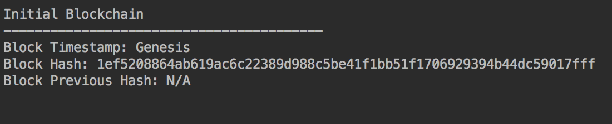
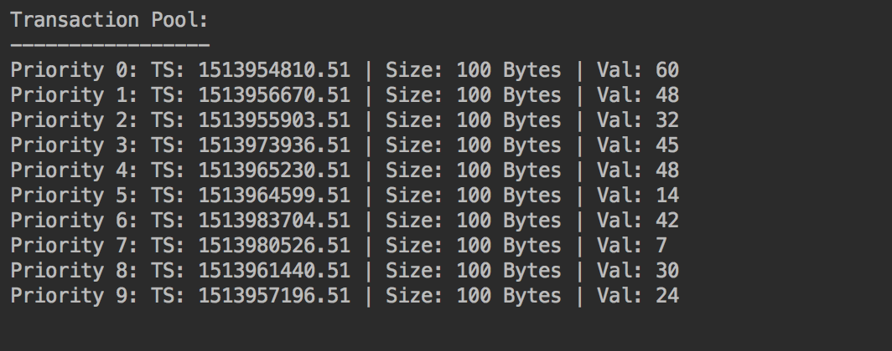
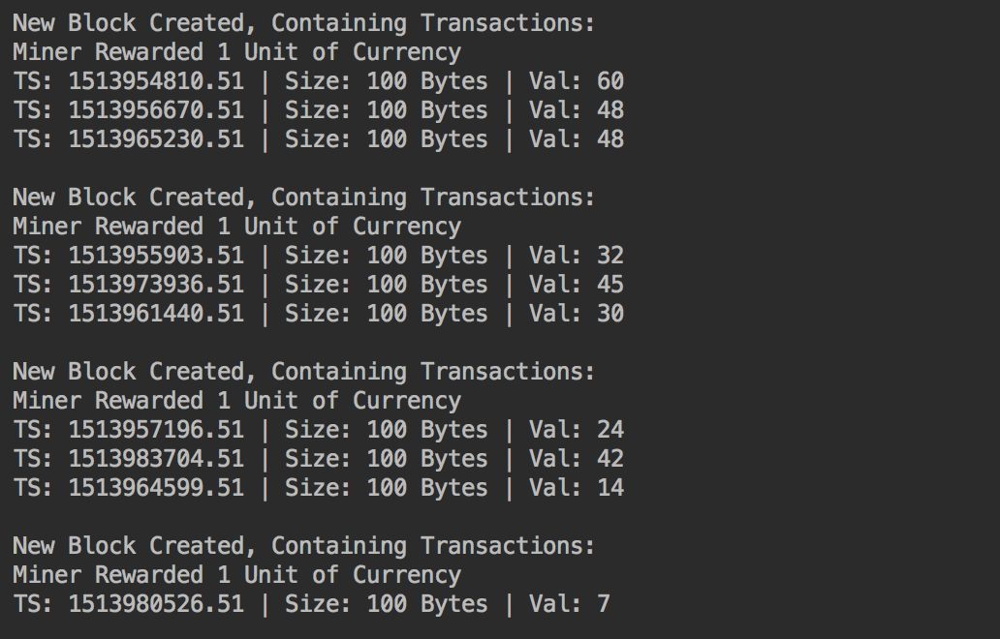
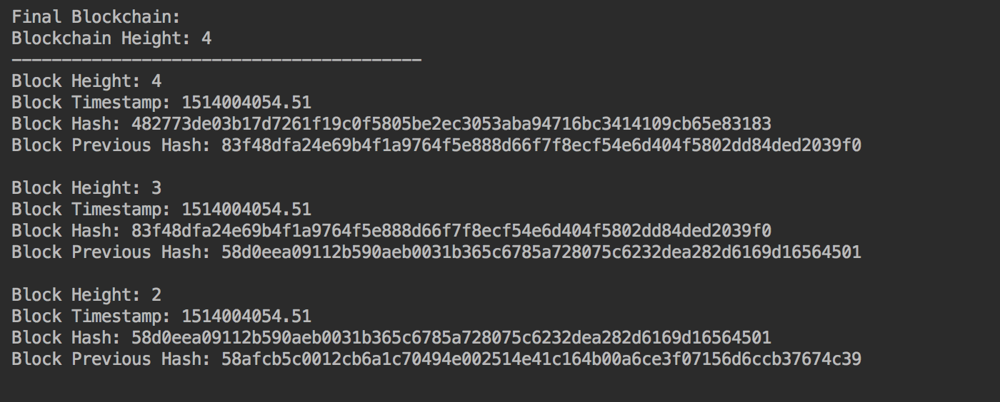

# Simple Blockchain

A basic implementation of a blockchain data structure for personal education, designed to illustrate the fundamentals of related concepts including decentralization, cryptographic hashing, transaction linking, digital signatures, and block mining.

### University of Michigan Demonstration
+ [Syllabus](https://drive.google.com/file/d/1c5NTQxJuT1IazXWPuM5mxSpuL5vU9aRw/view)
+ See [workshop/](https://github.com/namangupta9/blockchain/tree/master/workshop) to recreate from base template
+ Co-Instructor: [@izakfr](https://github.com/izakfr)

## Implementation Overview (Simplified)
Alpha, Bravo, Charlie, and Delta all buy in with 100 units worth of cryptocurrency, and transact six times between themselves. 

New transactions are executed by gathering a user's unspent transaction outputs, which all point back to the respective transactions they originated from. After the user digitally signs the transaction, and the recipient verifies the signature, the new transaction is added to a pool of un-mined transactions.

Miners compete in a proof-of-work competition to package transactions into blocks and collect the associated reward. The winning miner broadcasts the newly-created block across the network; each user maintains a local copy of all blocks, which link together and form a blockchain.

### Key Takeaway

Users in a network can securely transact (or share information) between each other without having to trust a central authority for verification, control, and distribution. All users maintain a copy of all past transactions (or shared information) through the blockchain, but can only transact (or access information) if they (and the counterparty) can verify their identity.

## Departures from Reality (Or, Room for Improvement)
Normally, a merkle root is included in the block, for purposes of saving memory space and verifying the validity of block transactions (Satoshi's White Paper)

A merkle tree would be created recursively using the hashes of all the transactions in the block. Not included in this implementation given the small size of the transaction set

Only one miner, so there's no real need for a proof-of-work competition here

## Sample Output

## Resources:
#### Satoshi Nakamoto's OG White Paper:
*https://bitcoin.org/bitcoin.pdf*
#### Blockchain Fundamentals:
*https://www.youtube.com/watch?v=bBC-nXj3Ng4*
#### Asymmetric Encryption & Digital Signatures:
*https://www.youtube.com/watch?v=Us_Og3JeXiI*
#### Transaction Structure:
*http://chimera.labs.oreilly.com/books/1234000001802/ch05.html*
#### Blockchain Structure:
*http://chimera.labs.oreilly.com/books/1234000001802/ch07.html*
#### Mining & Decentralized Consensus:
*http://chimera.labs.oreilly.com/books/1234000001802/ch08.html*
#### Coding Tips:
*https://bigishdata.com/2017/10/17/write-your-own-blockchain-part-1-creating-storing-syncing-displaying-mining-and-proving-work/*
